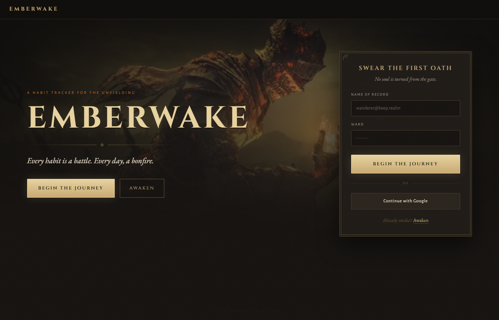
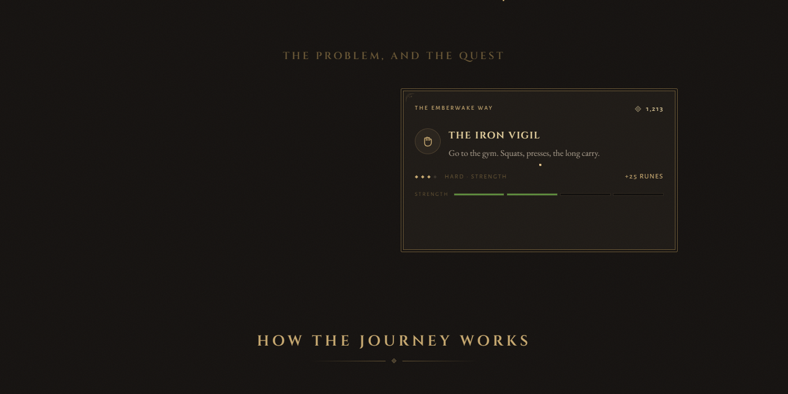

# Emberwake

A habit tracker themed as a grim, dark-fantasy Soulslike RPG. Habits become quests; completing one earns Runes and raises attributes; streaks are Bonfires; missed days drain Ember Flasks.

Built for the Life RPG project brief — see [`docs/`](./docs) for the full design spec and glossary.

**Live demo:** [emberwake-delta.vercel.app](https://emberwake-delta.vercel.app)

## Screenshots



*The Gate is the only screen a stranger can see. "Begin the Journey" and "Awaken" are real sign-up/log-in, backed by Postgres — not a mockup toggle.*



*Scrolling The Gate explains the loop before anyone commits: a real habit becomes a quest, judged in the same dark-fantasy terms as the rest of the app.*

## Our approach to the problem statement

The brief asked for a "Life RPG" — take real habits and make them feel like a game worth returning to, not a to-do list with a fresh coat of paint. Two beliefs shaped how we read that:

1. **Gamification fails when nothing is at stake.** A points counter that only ever goes up isn't a game. So a missed day in Emberwake actually costs something: it drains an Ember Flask (you only carry 3), and running out lets the streak's Bonfire go out and damages your Health — mirrored, non-euphemistic consequences instead of a guilt-trip notification. Runes and attributes level on deliberately non-linear curves (see [`docs/design-spec.md`](./docs/design-spec.md)) so early progress feels fast and later progress feels earned, the way an RPG's does.
2. **The "game" has to be real, not a skin.** So the RPG layer isn't client-side decoration on top of a normal habit list — the plan (see "Game systems" in the design spec) is for every reward to be computed server-side from a habit's actual completion, with the client only ever sending intent, so progress can't just be typed into `localStorage`.

That same bar — real, not a demo of real — is why the app is gated behind actual accounts rather than a click-through prototype: [`src/proxy.ts`](./src/proxy.ts) turns away every signed-out visitor at every screen but The Gate, sign-up/log-in hit a real Postgres database (Auth.js + Prisma, see below), and the result is deployed at a public URL instead of only ever running on one laptop.

The one place we're still short of that bar, in the interest of being honest about it: the Camp/Merchant/Relics/Chronicle screens still read from client-side sample data rather than each user's own row in the database (see "Status" below) — the account system is real, the game state behind it isn't wired to it yet.

## Status

All seven screens are built: The Gate (landing hero + About section), First Steps, The Camp, Chronicle, Merchant, Hall of Relics, and Moments. Real accounts exist — sign-up/log-in creates a row in Postgres and every in-app screen is gated behind a session.

Not yet done: the actual game state (quests, runes, attributes, relics) still lives in client-side React state seeded with sample data, not the database — so progress doesn't persist across a real login. Wiring the Camp/Merchant/Relics screens to the `Quest`/`Character`/etc. tables via API routes is the next piece of work. Google sign-in is scaffolded in the UI but not connected (no OAuth app registered yet).

## Tech stack

- **Frontend:** Next.js 16 (App Router, TypeScript), CSS Modules, Framer Motion (installed, not yet used)
- **Backend:** Next.js Route Handlers
- **Database:** PostgreSQL (Supabase) via Prisma ORM ([`prisma/schema.prisma`](./prisma/schema.prisma)), connected through `@prisma/adapter-pg` (Prisma 7 requires a driver adapter — there's no more bare `datasourceUrl` string)
- **Auth:** Auth.js v5, Credentials provider (bcrypt-hashed passwords in the `User` table), JWT sessions
- **Validation:** Zod

## Getting started

```bash
npm install
cp .env.example .env   # fill in DATABASE_URL, DIRECT_URL, AUTH_SECRET
npx prisma generate
npx prisma migrate dev --name init
npm run dev
```

Open [http://localhost:3000](http://localhost:3000). Sign up from The Gate — that's a real account.

### Environment variables

See [`.env.example`](./.env.example) for the full list:

| Variable | Purpose |
| --- | --- |
| `DATABASE_URL` | PostgreSQL connection string the app uses at runtime. On Supabase this is the **pooled** (PgBouncer, port 6543) string |
| `DIRECT_URL` | Direct/session connection, used only by `prisma migrate` (PgBouncer's transaction mode can't run migrations) |
| `AUTH_SECRET` | Auth.js session signing secret — generate with `openssl rand -base64 32` |
| `GOOGLE_CLIENT_ID` / `GOOGLE_CLIENT_SECRET` | Google OAuth sign-in (not wired up yet) |

## Auth & route protection

`src/proxy.ts` (Next.js 16 renamed `middleware.ts` → `proxy.ts`) redirects any signed-out visitor away from `/onboarding`, `/camp`, `/chronicle`, `/merchant`, `/relics`, and `/moments` back to The Gate, carrying `?next=<path>` so a successful sign-in lands them back where they started. The Gate's own panel toggles between "Begin the Journey" (sign-up, via `/api/register` then `signIn`) and "Awaken" (log-in) — both real, backed by `src/lib/auth.ts`.

## Database

The schema in [`prisma/schema.prisma`](./prisma/schema.prisma) models: `User`, `Character` (level, runes, health/focus, streak, ember flasks), `AttributeStat` (Vigor/Mind/Endurance/Strength/Dexterity), `Quest` (Vigils/Oaths/Bounties), `QuestCompletion` (permanent history log used for undo and anti-cheat), `DayLog`, `Item`/`InventoryItem` (the Merchant + Armory), `Relic`/`UserRelic` (Hall of Relics), `Indulgence`, and `Raven` (notifications).

Once the game screens are wired to it, all game math (runes, leveling, streaks, damage) is meant to run server-side — the client only ever sends intent.

## Assets

Design reference and imagery came from a Claude Design handoff (`docs/design-handoff/`) — see that folder's README for full design tokens, copy, and motion specs.
